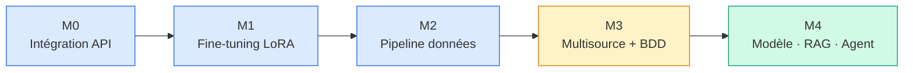

<div align="center">

# Espace de travail DiagOps

**Productions apprenant · Cursus Atlas/CISIA · Session S04**

[](#-parcours-des-modules)
[](../data_pack/)
[](../GIT_WORKFLOW.md)

*Chaque module vit ici, versionné sur votre dépôt privé — sans conflit avec le cours.*

</div>

---

## À quoi sert ce dossier ?

Le dépôt pédagogique publie briefs, starters et données sur `upstream/main`.  
**Vos livrables** — code, notebooks, rapports, preuves — restent dans `work/MN/`.

```text
upstream (cours)          origin (vous)
      │                         │
      ▼                         ▼
  M0/ … M8/              work/M0/ … work/M8/
  data_pack/             ← votre production versionnée
  tools/
```

> **Règle d'or** : le formateur ne publie jamais dans `work/`. Vous pouvez fusionner `upstream/main` sans écraser votre travail.

---

## Démarrage rapide

```bash
# Depuis la racine du dépôt
python3 tools/init_module.py M4    # remplacez M4 par le module visé

cd work/M4
python3 -m venv .venv
source .venv/bin/activate          # Windows : .venv\Scripts\activate
python3 -m pip install -r requirements.lock
python3 -m pytest -q               # si des tests sont fournis
```

| Étape | Commande | Détail |
|-------|----------|--------|
| Initialiser | `python3 tools/init_module.py MN` | Refuse d'écraser un dossier existant |
| Environnement | `python3 -m venv .venv` | Un venv **par module** |
| Données | `../../data_pack/2026-S1/` | Source unique — pas de copie dans `work/` |
| Config Git | voir [GIT_WORKFLOW.md](../GIT_WORKFLOW.md) | `origin` = vous · `upstream` = cours |

---

## Parcours des modules



| | Module | Focus | Stack clé | Notebook synthèse |
|---|--------|-------|-----------|-------------------|
| 🔌 | **[M0](M0/)** | Intégration modèle sur étagère | FastAPI · Pydantic · HF Inference · Streamlit | [`m0_integration_diagops.ipynb`](M0/notebooks/m0_integration_diagops.ipynb) |
| 🎯 | **[M1](M1/)** | Fine-tuning LoRA & évaluation | Transformers · PEFT · métriques diag | [`m1_lora_diagops.ipynb`](M1/notebooks/m1_lora_diagops.ipynb) |
| 🧹 | **[M2](M2/)** | Qualité, quarantaine, statistiques | pandas · validation · PII | [`m2_statistiques_atlas.ipynb`](M2/notebooks/m2_statistiques_atlas.ipynb) · [`notebook_audit_m2.ipynb`](M2/notebooks/notebook_audit_m2.ipynb) |
| 🗄️ | **[M3](M3/)** | Capteurs, registre, base de données | SQLAlchemy · Alembic · séries temporelles | [`m3_base_de_donnees_atlas.ipynb`](M3/notebooks/m3_base_de_donnees_atlas.ipynb) · [`notebook_multisource_m3.ipynb`](M3/notebooks/notebook_multisource_m3.ipynb) |
| 🛡️ | **[M4](M4/)** | Modèle simple, RAG minimal, agent borné | scikit-learn · retrieval · menaces | [`m4_modele_rag_diagops.ipynb`](M4/notebooks/m4_modele_rag_diagops.ipynb) |

<details>
<summary><strong>À venir (M5 → M8)</strong></summary>

| Module | Thème |
|--------|-------|
| M5 | Déploiement, CI d'évaluation, monitoring |
| M6 | Amélioration continue, feedback, campagne adversariale |
| M7 | Architecture, sécurité, souveraineté, migration |
| M8 | Nouveau projet RAG-agentique, audit, soutenance |

</details>

---

## Structure type d'un module

Chaque `work/MN/` suit une logique commune — les détails sont dans le README du module.

```text
work/MN/
├── README.md              ← guide d'installation et livrables
├── requirements.lock      ← dépendances figées
├── src/                   ← code métier
├── tests/                 ← tests automatisés
├── notebooks/             ← investigations et synthèses
├── templates/             ← modèles de rapports
├── docs/                  ← décisions, protocoles (selon module)
├── journal_bord.md        ← trace de vos choix
└── .venv/                 ← environnement local (ignoré par git)
```

---

## Bonnes pratiques

<table>
<tr>
<td width="50%">

### ✅ À faire

- Un environnement virtuel **par module**
- Journaliser vos décisions (`journal_bord.md`)
- Lire les notebooks de synthèse avant la soutenance
- Pointer vers `data_pack/` — ne pas dupliquer les données
- Committer souvent sur `origin/main`

</td>
<td width="50%">

### ⛔ À éviter

- Commiter `.env`, tokens ou secrets
- Copier `data_pack/` dans `work/`
- Écraser un module déjà initialisé sans sauvegarde
- Utiliser le jeu de test scellé pour le réglage (M4+)
- Pousser sur le dépôt pédagogique (`upstream`)

</td>
</tr>
</table>

---

## Liens utiles

| Ressource | Lien |
|-----------|------|
| Vue d'ensemble du cursus | [README racine](../README.md) |
| Configuration Git | [GIT_WORKFLOW.md](../GIT_WORKFLOW.md) |
| Données partagées | [data_pack/](../data_pack/) |
| Initialisation module | `python3 tools/init_module.py MN` |

---

<div align="center">

**DiagOps S04** — de l'intégration API au système agentique borné

*Dernière mise à jour : modules M0–M4 documentés*

</div>
